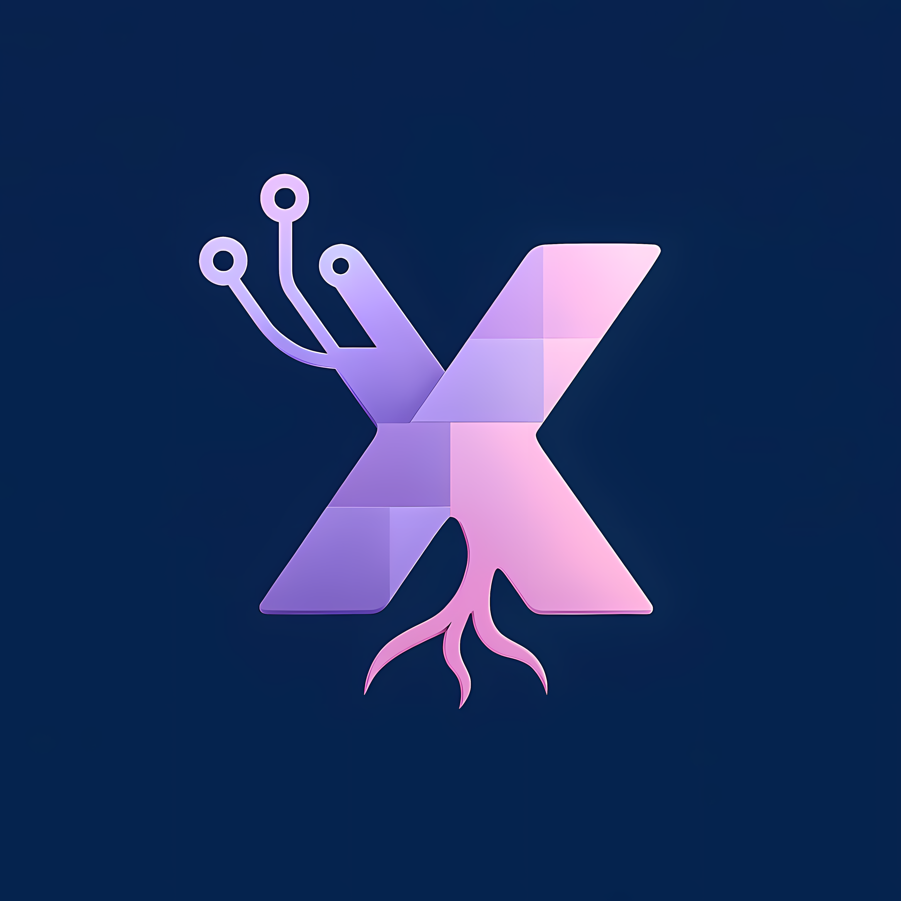

g<div align="center">
  
  
  <h1>Xylem Programming Language</h1>
  
  <p>
    <b>A statically-typed, block-structured language for modern programming.</b>
  </p>
  
  <p>
    <a href="https://www.rust-lang.org/"></a>
    
    
  </p>
</div>

---

## 🚀 Features

- **Variable declarations and assignments**
- **Functions** with typed parameters and return types
- **If/elif/else** statements
- **While and for** loops
- **Break** and **return**
- **Type checking** and semantic analysis
- **Error reporting**
- **Test suite** for language features

---

## 🛠️ Prerequisites

- [Rust](https://www.rust-lang.org/tools/install) (latest stable recommended)
- PowerShell (for running the test script on Windows)

---

## 🏗️ Building the Interpreter

<details>
<summary><b>Windows</b></summary>

```sh
# Clone the repo
git clone https://github.com/KronosWasTaken/Xylem.git
cd Xylem

# Build in release mode
cargo build --release
```
- The executable will be at <code>target/release/xylem.exe</code>.

</details>

<details open>
<summary><b>Linux / WSL / macOS</b></summary>

1. <b>Install Rust:</b>
   ```sh
   curl --proto '=https' --tlsv1.2 -sSf https://sh.rustup.rs | sh
   source $HOME/.cargo/env
   ```
2. <b>Install build tools (Linux only):</b>
   ```sh
   sudo apt update
   sudo apt install build-essential
   ```
3. <b>Clone the repository:</b>
   ```sh
   git clone https://github.com/KronosWasTaken/Xylem.git
   cd Xylem
   ```
4. <b>Build the project:</b>
   ```sh
   cargo build --release
   ```
   - The executable will be at <code>target/release/Xylem</code> (note the capital 'X').
5. <b>(Optional) Create a lowercase symlink for convenience:</b>
   ```sh
   ln -s "$PWD/target/release/Xylem" "$PWD/target/release/xylem"
   export PATH="$PATH:$PWD/target/release"
   ```
   <sub>Add the export line to your <code>~/.bashrc</code> or <code>~/.zshrc</code> to make it permanent.</sub>

</details>

---

## ▶️ Running .xl Programs

- <b>Windows:</b>
  1. Add <code>xylem.exe</code> to your <b>PATH</b>
  2. Open a terminal in the folder containing your <code>.xl</code> file.
  3. Run:
     ```sh
     xylem your_file.xl
     ```

- <b>Linux / WSL / macOS:</b>
  1. If you created the symlink and updated your PATH, you can run:
     ```sh
     xylem your_file.xl
     ```
  2. Or, use the full path (from anywhere):
     ```sh
     /full/path/to/Xylem/target/release/Xylem your_file.xl
     ```
  3. Or, from the project root:
     ```sh
     ./target/release/Xylem your_file.xl
     ```

**Example:**
```sh
xylem example.xl
```

---

## 🧪 Running the Test Suite

All language tests are in the <code>tests/</code> folder as <code>.xl</code> files.

### On Windows (PowerShell)
Use the provided script:
```sh
./run_all_tests.ps1
```
This will run all <code>.xl</code> files in the <code>tests/</code> folder and report any failures.

---

## 📚 Language Reference
- See [`src/grammar.ebnf`](src/grammar.ebnf) for the full language grammar.

## 🌟 Example
- See [`example.xl`](example.xl) for a showcase of all language features.

---

<div align="center">
  <sub>Made with ❤️ by KronosWasTaken</sub>
</div>

---